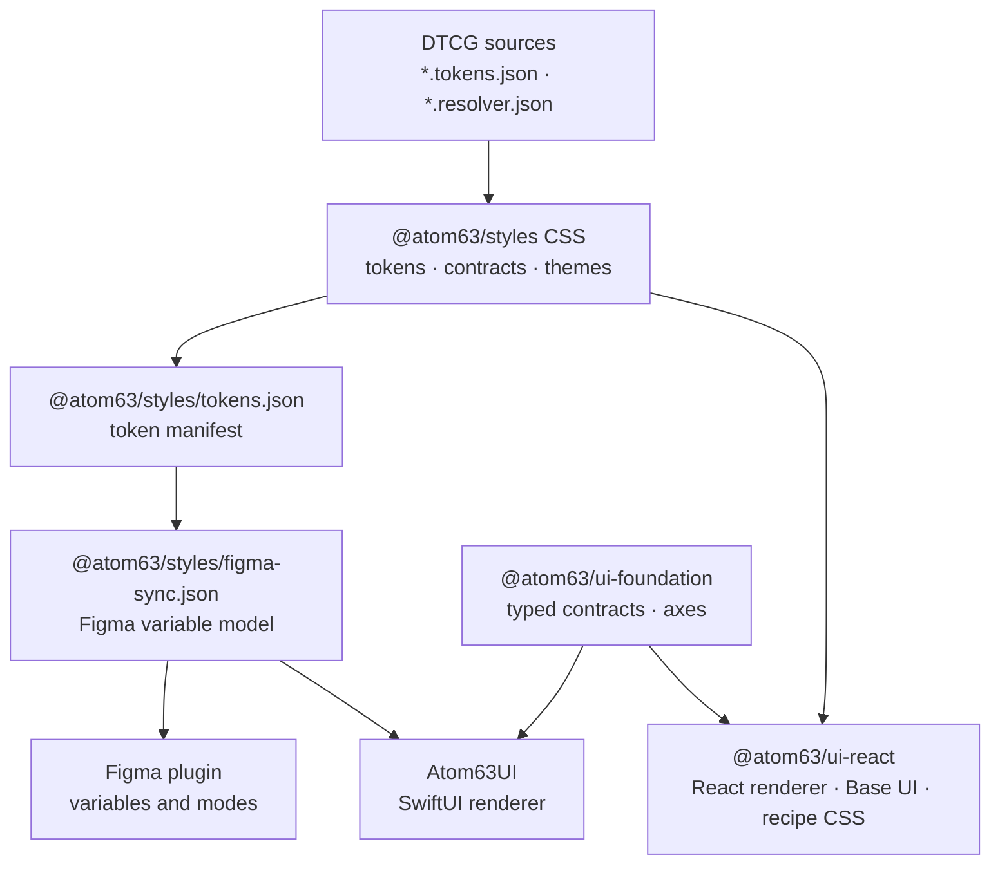
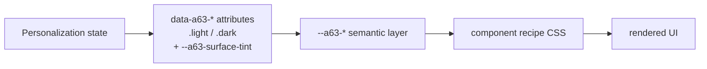

# Architecture overview

Atom63 keeps one token architecture and renders it on every platform it supports. The same decisions should be legible to code, docs, design files, humans, and agents.

## System goals

| Goal | What it protects |
|------|------------------|
| One source of truth | Tokens, contracts, docs, and design files describe the same system. |
| One token interface | Every renderer reads the generated token manifest instead of re-parsing CSS. |
| Executable design decisions | Themes and personalization resolve through attributes and variables, not prose alone. |
| Verified consumption | Packages are tested the way consumers install them: packed, from the registry, and in Vite dev. |

## The stack

| Layer | Owns | Does not own |
|-------|------|--------------|
| `@atom63/styles` | CSS variables, semantic tokens, theme value overrides, the Tailwind bridge, the token manifest, and the Figma variable model. | React behavior or product state. |
| `@atom63/ui-foundation` | TypeScript contracts, component vocabularies, and personalization axis metadata shared by every renderer. | DOM or SwiftUI rendering. |
| `@atom63/ui-react` | React components, Base UI composition, recipe CSS, and appearance UI. | App routing, fetching, or product content. |
| `Atom63UI` | SwiftUI components whose colors are generated from the resolved Figma variable model. | Web behavior. |
| Figma plugin | Writing the Figma variable model into a file: one collection per personalization axis, aliases where tokens reference each other. | Deciding token values; code is the source. |
| Consumer apps | Routes, storage choices, app chrome, data adapters, and content. | Reusable component contracts. |

## Runtime model

The design system resolves through attributes and semantic variables. `UIProvider` can stamp design language, mode, theme, brand, input, density, and surface on a subtree. `applyPersonalization` stamps mode, theme, brand, surface, type scale, radius, font, OS, and icon theme on a root, plus the `--a63-surface-tint` scalar.

Components do not ask "am I Aqua?" or "am I dark?" Recipes read `--a63-*` variables, while OS and icon renderers may also read their dedicated attributes. The cascade resolves the active axis values without theme-specific React branches.

The same axes become Figma collections: each axis varies its own tokens, so each maps to one collection whose modes are the axis values.

## Where to edit

| Need | Owner |
|------|--------|
| Shared palette / space / radius / type / blur | `@atom63/styles` foundation |
| Skin character (gel, bevel, CRT) | `@atom63/styles` themes under `[data-a63-theme]` |
| Shared control-family hooks | `@atom63/styles` contracts (growth rule) |
| Typed axes / component vocabulary | `@atom63/ui-foundation` |
| React behavior + recipes | `@atom63/ui-react` |
| SwiftUI components | `packages/ui-ios` |

Handbook for humans and agents: repo `docs/design-system/README.md`. Canonical where-to-edit: `docs/design-system/authoring-surfaces.md`.

## Build and verification

| Concern | Guardrail |
|---------|-----------|
| Token manifest and Figma model | `pnpm --filter @atom63/styles check:tokens` and `check:figma` |
| Swift tokens and contracts | `generate-swift-tokens.mjs --check` and the cross-renderer contract check |
| Published package shape | `pnpm check:ds-pack-smoke`: typecheck, production build, and Vite dev resolution against packed tarballs |
| Registry installs | `pnpm check:ds-registry-smoke` |
| Component utilities for consumers without Tailwind | `pnpm --filter @atom63/ui-react check:utilities` |
