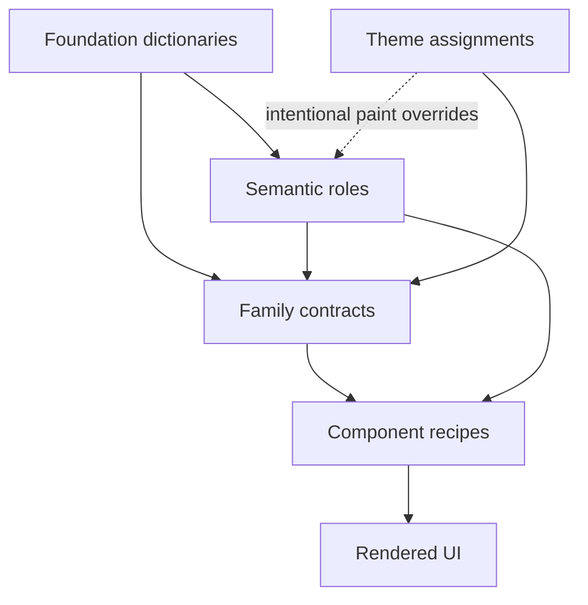

# Themes

Atom63 themes are CSS skins over one semantic system. They change material character without changing component anatomy, behavior, or product structure.

## The ownership boundary

I keep the layers separate so a skin can be expressive without becoming a second design system.

| Layer | Owns | Does not own |
|-------|------|--------------|
| Foundation | Shared palette, space, radius, type, blur, shadow, and motion dictionaries. | Aqua gel, Retro bevels, or Terminal phosphor recipes. |
| Semantics | Roles such as `--a63-surface-panel`, `--a63-text-secondary`, and `--a63-action-primary`. | Component anatomy or skin-specific stacks. |
| Contracts | Reusable family seams such as `--a63-control-shadow`, `--a63-field-shadow`, and `--a63-overlay-gloss`. | A new value dictionary for each component. |
| Themes | Contract assignments and skin-private material under `[data-a63-theme]`. Aqua and Terminal also make deliberate, mode-specific semantic paint overrides. | Slots, DOM, variants, accessibility, OS geometry, or app policy. |
| Recipes | Component structure, states, variants, and local CSS-variable mapping. | Per-theme branches. |

The canonical ownership rules live in `docs/design-system/authoring-surfaces.md`. When a theme needs a stop that another theme, a contract default, or an adapter also needs, that stop graduates into foundation.

## How the skin reaches UI

The contracts are deliberately broader than a component name. A skin can make raised controls glossy through `--a63-control-*`, or floating surfaces textured through `--a63-overlay-*`, without selecting every Button, Menu, or Dialog recipe.

## Shipped skins

| ID | Character | Current behavior |
|----|-----------|------------------|
| `modern` | Restrained identity baseline. | Explicit tactile control and field shadows, quiet segmented plates, and a subtle specialized-surface rim. |
| `aqua` | Translucent gel and specular depth. | Fixed blue surface cast, overlay-only pinstripes, blur, and separate light/dark paint. Primary actions still follow the brand axis. |
| `retro` | Early-web / Windows 98 tactility. | Hard bevel stacks, stronger borders, and collapsed press shadows while luminance inherits from mode semantics. |
| `terminal` | Monochrome CRT material. | Brand-derived phosphor glow, scanlines, control-level mono type, and separate light/dark surface and text paint. |

`modern` is not the absence of a theme. Its material values live under `[data-a63-theme='modern']`, so runtimes stamp it explicitly.

## Contract seams themes use

The current skins primarily assign:

- control material: `--a63-control-shadow`, `--a63-control-shadow-active`, `--a63-control-gloss`, `--a63-control-highlight`
- fields and tracks: `--a63-field-shadow`, `--a63-track-shadow`, with Terminal also assigning `--a63-field-background`
- surfaces and overlays: `--a63-surface-*` and `--a63-overlay-*` material handles for shadow, gloss, backdrop, border, and texture
- dense selection families: `--a63-segment-*`, `--a63-choice-*`, and `--a63-marker-*`
These are contract handles, not a promise that every handle is assigned by every skin. Recipe-local variables such as `--button-background` remain implementation details.

## What themes are not

Mode, brand, neutral surface, surface tint, radius, type scale, font, density, design language, input, OS, and icon presentation remain independent axes. A product may group them in one Appearance panel, but that UI grouping does not transfer ownership to the theme.

Old `[data-ui-theme]` and broad `--theme-*` component variables are archived migration residue. The live selector is `[data-a63-theme='<id>']`; slide themes use a separate `--theme-slide-*` contract.

Continue to [Theme system](/themes/theme-system) for selector rules, load order, runtime stamping, and the authoring workflow.
